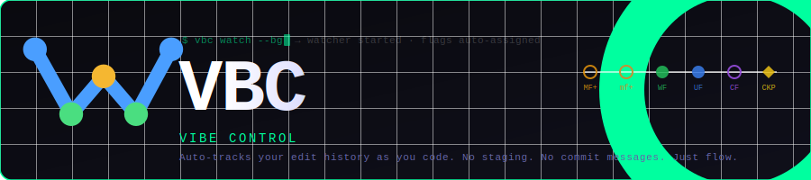

<div align="center">



**VIBE Control** — version control for vibe coders

*Auto-tracks your edit history as you code. No staging. No commit messages required. Just flow.*


**Created by [Pratham Kumar Uikey](https://github.com/pratham1kruk)**

</div>

---

## Table of Contents

- [What is VBC?](#what-is-vbc)
- [How it Works](#how-it-works)
- [Flag Visual Language](#flag-visual-language)
- [Installation](#installation)
  - [Requirements](#requirements)
  - [Windows](#windows)
  - [Linux](#linux)
  - [VS Code Extension](#vs-code-extension)
  - [Updating the CLI](#updating-the-cli)
- [Quick Start](#quick-start)
- [Full Command Reference](#full-command-reference)
- [.vbcignore](#vbcignore)
- [VS Code Extension](#vs-code-extension-1)
- [Project Structure](#project-structure)
- [How Data is Stored](#how-data-is-stored)
- [Design Principles](#design-principles)
- [Quick Reference Card](#quick-reference-card)

---

## What is VBC?

VBC is a lightweight version control system built around the way vibe coders actually work — saving files rapidly, iterating fast, and figuring things out as they go.

Instead of manually running `git add` and writing commit messages for every small change, VBC **watches your files** and automatically assigns **flags** to each save. When something important works, you explicitly mark it. When you reach a stable milestone, you drop a checkpoint.

```
  ┌─ AUTO (watcher) ──────────────────────────────────────────────┐
  │  Every save → MF+  mf+  CF  MF-  (march flags)               │
  └───────────────────────────────────────────────────────────────┘
  ┌─ MANUAL (you decide) ─────────────────────────────────────────┐
  │  vbc plot we flag   →  WF   (file committed)                  │
  │  vbc plot us flag   →  UF   (all files committed)             │
  │  vbc plot ckp       →  CKP  (full project snapshot)           │
  └───────────────────────────────────────────────────────────────┘
```

> **VBC is not a replacement for Git.** Use VBC *during* your coding session to capture every step. Push to Git when you are ready to ship.

---

## How it Works

```
  You save a file
       │
       ▼
  Watcher detects the change
       │
       ▼
  Differ classifies it
     ├── >75% lines changed       →  MF+   (full replace)
     ├── partial edit             →  mf+   (incremental)
     ├── matches another file     →  CF    (copy)
     └── file shortened back      →  MF-   (revert)
       │
       ▼
  Flag written to .vbc/snapshot.prt
       │
       ▼
  You decide when to commit
     ├── vbc plot we flag <file>  →  WF   (collapses march flags for that file)
     ├── vbc plot us flag         →  UF   (collapses march flags for all files)
     └── vbc plot ckp             →  CKP  (full snapshot → stver.prt)
```

---

## Flag Visual Language

Every change in VBC is recorded as a typed, colored flag.

| Symbol | Color | Flag | Triggered | Meaning |
|:------:|-------|------|:---------:|---------|
| `●` | 🟡 Yellow | `MF<n>+` | Auto | Full file replaced — first save or >75% lines changed |
| `○` | 🟠 Amber  | `mf<n>+` | Auto | Partial edit — some lines changed |
| `◆` | 🟣 Purple | `CF<n>`  | Auto | Copy event — content matches another tracked file |
| `◀` | 🔴 Red    | `MF<n>-` | Auto | Revert — file shortened back toward earlier state |
| `✔` | 🟢 Green  | `WF<n>`  | You  | Single file commit — collapses all march flags for that file |
| `✔` | 🔵 Blue   | `UF<n>`  | You  | Project-wide commit — collapses march flags on all files |
| `⬟` | 🟡 Gold   | `ckp<n>` | You  | Full project snapshot — all files saved to `stver.prt` |

**Flag numbering** is per-file, per-type. `MF3+` = third full-replace on that file. `WF2` = second time you committed it.

---

## Installation

### Requirements

- Windows 10/11 or Linux (x64)
- VS Code 1.85+ *(for the extension — optional)*

---

### Windows

Download and run the installer:

```
windows_installer/
└── VBC_Installer.exe
```

Run `VBC_Installer.exe` and follow the wizard. It will:

| Step | Action |
|------|--------|
| Welcome screen | Shows project name, description, author + GitHub |
| License screen | Displays LICENSE — you must accept to proceed |
| Directory screen | Default: `%LOCALAPPDATA%\vbc-cli` — you can change it |
| Install files | Copies VBC into the install directory |
| PATH | Adds install dir to user PATH (no admin rights needed, no reboot) |
| Launcher | Creates `vbc.cmd` wrapper so `vbc` works from any terminal |
| VS Code ext | Optional step — installs the extension automatically |
| Start Menu | Creates `VBC\VBC Help.lnk` shortcut |
| Registry | Registers in Add/Remove Programs under your name |
| Finish screen | Success message with GitHub link, option to open terminal |

**Verify:**
```cmd
vbc help
```

---

### Linux

You need two files from the `linux/` folder:

```
linux/
├── vbc-linux-x64-v1.0.0      ← the binary
└── vbc-install.sh             ← the installer script
```

**1. Download both files into the same folder, then run:**
```bash
bash vbc-install.sh
```

The script will:
- Copy the binary to `~/.vbc-cli/vbc`
- Create a symlink at `/usr/local/bin/vbc` (may ask for sudo password)
- If sudo fails, automatically add it to `~/.bashrc` instead

**2. Open a new terminal and verify:**
```bash
vbc help
```

#### Update

```bash
bash vbc-install.sh --update
```

#### Uninstall

```bash
bash vbc-install.sh --uninstall
```

#### Troubleshooting

**`Permission denied` on the binary:**
```bash
chmod +x vbc-linux-x64-v1.0.0
bash vbc-install.sh
```

**`vbc` not found after install:**
```bash
source ~/.bashrc    # or just open a new terminal
```

---

### VS Code Extension *(optional but recommended)*

The extension is bundled inside the Windows installer and installed automatically. If you need to install it manually:

```bash
code --install-extension vbc-extension.vsix
```

Then reload VS Code:
```
Ctrl+Shift+P → Developer: Reload Window
```

---

### Updating the CLI

```bash
vbc update C:\path\to\new-version          # Windows
vbc update /home/user/new-version          # Linux
```

---

## Quick Start

```bash
# 1. Go to your project
cd my-project

# 2. Initialize VBC (creates .vbc/ + .vbcignore)
vbc init

# 3. Start the watcher
vbc watch

# 4. Code normally — save files — flags appear automatically
#    → MF1+  main.py was fully replaced
#    → mf2+  utils.py had a partial edit

# 5. Commit a file when it is working
vbc plot we flag src/main.py -ms "login done"

# 6. Commit everything
vbc plot us flag -ms "session 1 complete"

# 7. Drop a stable checkpoint
vbc plot ckp -ms "v1.0 — auth + dashboard"
```

---

## Full Command Reference

### `vbc init`
Initialize a VBC repository in the current folder.

```bash
vbc init
```

Creates `.vbc/` with `header.json`, `snapshot.prt`, `stver.prt`, and a default `.vbcignore` in the project root.

---

### `vbc watch`
Start the file watcher. Auto-assigns march flags on every save.

```bash
vbc watch                  # foreground — Ctrl+C to stop
vbc watch --bg             # background daemon
vbc watch --stop           # stop the background daemon
vbc watch --status         # check if daemon is running
vbc watch --tail           # live log tail of background daemon
```

---

### `vbc flag`
Manually set a march flag without the watcher running.

```bash
vbc flag mf+ <file>
vbc flag mf+ <file> -ms "added helper"
vbc flag mf- <file>
vbc flag cf  <file>
```

---

### `vbc plot`
Set commit-level flags or a checkpoint.

```bash
# Commit a single file → WF (collapses all march flags for that file)
vbc plot we flag <file>
vbc plot we flag src/auth.py -ms "JWT login working"

# Commit all files → UF on each
vbc plot us flag
vbc plot us flag -ms "all routes done"

# Full project snapshot → CKP
vbc plot ckp
vbc plot ckp -ms "v1.0 — login + dashboard complete"
```

**On WE flag:** march flags for that file (`MF+`, `mf+`, `CF`, `MF-`) are purged and collapsed into a single `WF`. Terminal shows what was collapsed.

**On CKP:** every file in the project is snapshotted into `stver.prt`. Becomes a permanent restore point.

---

### `vbc reset`
Restore files to a previous committed state.

```bash
# Restore file to its latest WF
vbc reset we flag <file>

# Restore file to a specific WF number
vbc reset we flag src/api.py -at WF2

# Restore all files to latest UF
vbc reset us flag

# Restore all files to a specific UF
vbc reset us flag -at UF3
```

---

### `vbc clone`
Export a checkpoint as a zip archive.

```bash
vbc clone ckp1 as v1.zip
vbc clone ckp3 as project-march-backup.zip
```

---

### `vbc reconstruct`
Restore a project from a cloned zip.

```bash
vbc reconstruct v1.zip as project-v1
vbc reconstruct project-march-backup.zip as restored
```

---

### `vbc construct`
Scaffold a project from a `.prt` tree diagram file.

```bash
vbc construct myapp.prt as myapp           # create directory structure
vbc construct myapp.prt as myapp c3        # + generate codebase doc
vbc construct myapp.prt as myapp scc       # + run source code analysis
```

**Example `.prt` file:**
```
myapp/
├── src/
│   ├── main.py
│   └── utils.py
├── tests/
│   └── test_main.py
└── README.md
```

---

### `vbc log`
Show flag history.

```bash
vbc log               # all files
vbc log src/main.py   # specific file
```

---

### `vbc status`
Show repo stats — version counter, file count, flag counts, watcher state.

```bash
vbc status
```

---

### `vbc update`
Update the CLI from a newly extracted folder.

```bash
vbc update C:\Downloads\vbc_unified     # Windows
vbc update /home/user/vbc_unified       # Linux / WSL
```

On WSL, automatically updates both the WSL and Windows sides.

---

### `vbc help`

```bash
vbc help              # all commands
vbc help watch
vbc help plot
vbc help reset
```

---

## .vbcignore

`vbc init` creates a `.vbcignore` file in your project root. Files and folders matching these patterns are completely invisible to the watcher.

```gitignore
# Directories — trailing slash
node_modules/
dist/
build/
.git/
__pycache__/
.venv/

# Wildcards
*.log
*.pyc
*.min.js
*.min.css
*.map

# Exact filenames
package-lock.json
yarn.lock
pnpm-lock.yaml
```

> Restart the watcher after editing `.vbcignore` — it reads the file only at startup.

---

## VS Code Extension

### Keyboard Shortcuts

| Shortcut | Action |
|----------|--------|
| `Ctrl+Shift+W` | Plot WE Flag on active file |
| `Ctrl+Shift+U` | Plot US Flag on all files |
| `Ctrl+Shift+K` | Plot Checkpoint |
| `Ctrl+Shift+G` | Open VBC Graph (full tab) |

### VBC Graph

Open from the activity bar or `Ctrl+Shift+G`. The graph is a live SVG tree of your project history growing **left to right**:

```
ROOT ●──── src/ ■──── main.py ○──── MF1+ ●── mf2+ ●── WF1 ●
           │         └── utils.py ○──── WF1 ●
           └── components/ ■──── App.jsx ○──── mf1+ ●── WF1 ●
     ⬟ ckp1  "v1 stable"
     ⬟ ckp2  "v2 dashboard done"
```

| Node | Shape | Meaning |
|------|-------|---------|
| ROOT | Large filled circle | Repository root |
| CKP | Gold diamond `⬟` | Checkpoint — on root spine |
| Folder | Rounded square | Directory internal node |
| File | Hollow circle | File leaf — branch grows with each flag |
| WF / UF | Filled circle | Commit flags |
| MF+ / mf+ / CF / MF- | Hollow circle | March flags (color-coded) |

**Interactions:**
- **Click any flag** → diff panel opens with before / after content
- **Click a CKP diamond** → popup: Reset project · Clone as zip · Make c3 doc
- **Hover any node** → tooltip with type, timestamp, stats, message

**Search & Filter:**
- Type in the search box → matching nodes highlight, canvas scrolls to first hit
- Press **Enter** to jump to the next match and cycle through all
- Click flag type buttons (`WF` / `UF` / `MF+` / etc.) to show only those types
- **✕ Clear** resets everything

### Command Palette

Press `Ctrl+Shift+P` and type **VBC** to access all commands: plot, reset, log, status, start/stop watcher, open graph.

---

## Project Structure

```
VBC/                          ← repo root
├── assets/
│   └── vbc-banner.svg        ← banner image
├── linux/
│   ├── vbc-linux-x64-v1.0.0  ← Linux binary
│   └── vbc-install.sh        ← Linux installer script
├── windows_installer/
│   └── VBC_Installer.exe     ← Windows NSIS installer
├── LICENSE
├── README.md
└── vbc-icon.ico              ← app icon
```

---

## How Data is Stored

VBC stores everything in `.vbc/` at your project root. No database, no binary blobs — plain text you can open in any editor.

```
.vbc/
├── header.json      ← { version, ckpCount, initTime, projectRoot }
├── snapshot.prt     ← line-separated JSON, one entry per flag (WF/UF/MF+/mf+/CF/MF-)
└── stver.prt        ← checkpoint entries only, with full file content snapshots
```

`.vbcignore` lives at the **project root** (not inside `.vbc/`), same convention as `.gitignore`.

---

## Design Principles

- **Zero external dependencies** — pure Node.js builtins: `fs`, `path`, `zlib`, `os`, `child_process`
- **Zero ceremony** — no staging area, no index, no required commit messages
- **Always readable** — `.prt` files are plain JSON; grep them, cat them, open them
- **Non-destructive** — reset never deletes flag history, only restores file content
- **Offline-first** — no network calls, no cloud, everything is local

---

## Quick Reference Card

```
vbc init                                       initialize repo
vbc watch                                      start watcher (foreground)
vbc watch --bg / --stop / --status / --tail    daemon controls
vbc flag mf+ <file> -ms "msg"                  set march flag manually
vbc plot we flag <file> -ms "msg"              commit single file  → WF
vbc plot us flag -ms "msg"                     commit all files    → UF
vbc plot ckp -ms "msg"                         full snapshot       → CKP
vbc reset we flag <file>                       restore file to last WF
vbc reset we flag <file> -at WF2               restore file to specific WF
vbc reset us flag                              restore all to last UF
vbc clone ckp<n> as <name>.zip                 export checkpoint as zip
vbc reconstruct <name>.zip as <dir>            unpack checkpoint zip
vbc construct <file>.prt as <dir>              scaffold from tree diagram
vbc log / vbc log <file>                       flag history
vbc status                                     repo stats
vbc update <path>                              update CLI from new folder
vbc help / vbc help <cmd>                      help
```

---

<div align="center">

Made by **Pratham Kumar Uikey** &nbsp;·&nbsp; [github.com/pratham1kruk](https://github.com/pratham1kruk)

*Built for vibe coders.*

© 2025 Pratham Kumar Uikey — All rights reserved. See [LICENSE](./LICENSE).

</div>