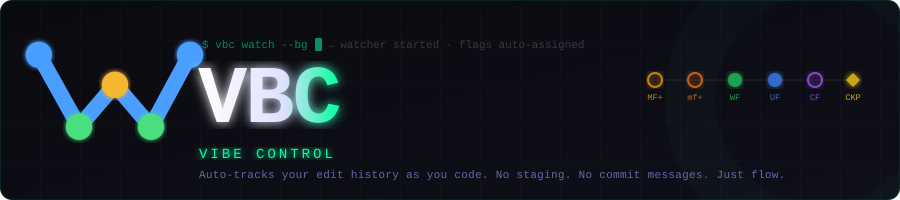

<div align="center">



### Version control for vibe coders

**Auto-tracks your edit history as you code. No staging. No commit messages required. Just flow.**


**[Windows](#windows) · [Linux](#linux) · [macOS](#macos) · [WSL](#wsl) · [VS Code Extension](#vs-code-extension)**

</div>

---

## Why VBC

Git is built for history you intend to keep. VBC is built for the history you make *while getting there* — every save, every experiment, every half-working idea — without asking you to stage a file or write a commit message first.

- **Zero ceremony.** Start the watcher and code. Every save is captured automatically.
- **Byte-exact.** Text, images, PDFs, executables — everything round-trips exactly, always.
- **Your checkpoints, your numbering.** Drop a full project snapshot whenever you hit a stable point, and choose its number yourself.
- **Offline, always.** No account, no cloud, no network calls. Everything lives in `.vbc/` at your project root.
- **Not a Git replacement.** Use VBC *during* a coding session to capture every step, then push to Git when you're ready to ship.

VBC ships as a **standalone binary** on every platform below — no Node.js required to install or run it.

---

## Install

Pick your platform. Each folder in this repository is self-contained: everything you need for that platform is inside it.

### Windows

**Recommended — full installer:**

```
windows_installer\VBC_Installer.exe
```

Run it and follow the prompts. It installs `vbc.exe`, adds it to your PATH, and installs the VS Code extension automatically if VS Code is detected.

**Alternative — binary + script:**

```
cd windows
.\vbc-install.bat
```

Open a new terminal, then run `vbc help` to confirm the install.

### Linux

**Debian / Ubuntu — `.deb` package:**

```bash
sudo apt install ./linux_deb_package/vbc_1.0.1_amd64.deb
```

Installs `vbc` to `/usr/local/bin`, on your PATH immediately. Auto-installs the VS Code extension if `code` is on PATH.

**Any distro — binary + script:**

```bash
cd linux
bash vbc-install.sh
```

Restart your shell, then run `vbc help` to confirm the install.

### macOS

**Recommended — binary + script:**

```bash
cd macOS
bash vbc-install.sh
```

Same install script as Linux — installs the compiled binary, no Node.js required.

**Prefer a native `.pkg`?** Building a signed macOS installer requires Apple's own tooling, which only runs on a Mac — so instead of an unsigned prebuilt file, we ship you the build script directly:

```bash
cp macOS/vbc-macos-x64-v1.0.1 macOS_package/
cp macOS/vbc-vibe-control-0.1.0.vsix macOS_package/
cd macOS_package
chmod +x build-vbc-macos-pkg.sh
./build-vbc-macos-pkg.sh          # Intel
./build-vbc-macos-pkg.sh arm64    # Apple Silicon
```

This builds a local `.pkg` you install the normal double-click way. Both install paths are fully supported — use whichever you prefer.

### WSL

From inside your WSL distro, after installing VBC on Windows:

```bash
vbc sync wsl
```

If more than one distro is registered, you'll be asked which one(s) to link.

---

## VS Code Extension

Every install method above installs the extension automatically if VS Code is detected. To install it manually:

```bash
code --install-extension vbc-vibe-control-0.1.0.vsix
```

(the `.vsix` is included in each platform folder — `linux/`, `macOS/`, and `windows/`)

Then reload VS Code: `Ctrl+Shift+P` → **Developer: Reload Window**.

---

## Quick Start

```bash
cd my-project
vbc init                                    # creates .vbc/ + .vbcignore
vbc watch                                   # start the watcher

# code normally — flags appear automatically as you save

vbc plot we flag src/main.py -ms "login done"      # commit a file
vbc plot us flag -ms "session 1 complete"          # commit everything
vbc plot ckp as ckp1 -ms "v1.0 — stable"           # full snapshot, your number
```

Run `vbc help` for the full command reference, or `Ctrl+Shift+P` → **VBC** inside VS Code.

---

## What's in this repository

| Path | Contents |
|---|---|
| `windows_installer/` | `VBC_Installer.exe` — full Windows installer |
| `windows/` | Standalone Windows binary, install script, VS Code extension |
| `linux_deb_package/` | `.deb` package for Debian/Ubuntu |
| `linux/` | Standalone Linux binary, install script, VS Code extension |
| `macOS/` | Standalone macOS binary, install script, VS Code extension |
| `macOS_package/` | Build script for a native `.pkg` — bring your own binary + `.vsix` from `macOS/` |
| `assets/` | Shared branding assets |

No source code, and no Node.js requirement, anywhere in this bundle except a manual WSL source install.

---

## License

© 2025 Pratham Kumar Uikey — All rights reserved. See [LICENSE](./LICENSE).

<div align="center">

Made by **Pratham Kumar Uikey** · [github.com/pratham1kruk](https://github.com/pratham1kruk)

*Built for vibe coders.*

</div>
